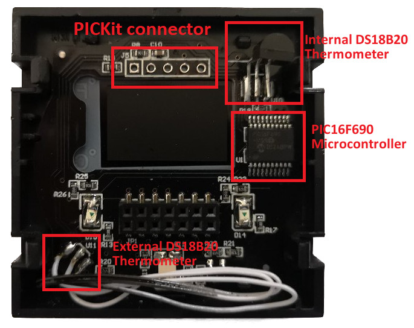

# Hardware
The circuit is pretty straightforward if you have some experience with microcontrollers. The capacity sensor piece was new to me but the Microchip application note AN1101 gives a pretty good overview (worth reading it)  
  
Mainboard with external thermometer

## Pinout of the PICF16690 microcontroller
```
                                -------- 
                          Vdd -| 1    20|- Vss
                  BCD_A / RA5 -| 2    19|- RA0 / Digit left  / ICSPDAT
                  BCD_B / RA4 -| 3    18|- RA1 / Digit right / ICSPCLK
                    Vpp / RA3 -| 4    17|- RA2 / T0CKI (connected to C2OUT)
                  BCD_C / RC5 -| 5    16|- RC0 / Power LED
                  C2OUT / RC4 -| 6    15|- RC1 / C12IN1-    + sensor
 Power sensor   C12IN3- / RC3 -| 7    14|- RC2 / C12IN2-    - sensor
                  BCD_D / RC6 -| 8    13|- RB4 / External thermometer / Light sensor (mod)
                Celsius / RC7 -| 9    12|- RB5 / Valve relay
             Fahrenheit / RB7 -|10    11|- RB6 / Internal thermometer / External thermometer (mod)
                                -------- 
```
## Display
Pins RA5, RA4, RC5 and RC6 are connected to the input of a BCD to 7-segment decoder in the mainboard. The common pins of the two 7-segment displays are connected to RA0 and RA1.
The softawre then just need to switch fast enough between both. In my firmware this is done in the timer 2 interrupt, which is set to 10ms (100Hz)  
The unit LEDs (Celcsius/Fahrenheit are connected to RC7 and RB7).  
The '+', '-' and power LED are connected to RC0 with 3 possible states:  
* Pin configured as input: '+','-' lit, power blue (very dim)
* Pin configured as output with high: '+','-' lit, power red
* Pin configured as output with low: '+','-' off, power blue
## Output
The relay for output is connected to RB5. High is active.
## Capacity sensor
The circuit is pretty much like in AN1101, but using internal reference voltages and the output is connected to timer 0
```
                     CVref   |\ C1      --------
             ----   C1Vref --|+\       |        |
  C12IN1- --|    |           |  |------| S    Q |
  C12IN2- --|C1CH|-----------|-/ (inv) |        |
  C12IN3- --|    |           |/        |        |
             ----                      |        |
                     0.6V    |\ C2     |        |
             ----   C2Vref --|+\       |      _ |  C2OUT  T0CKI  ---------
  C12IN1- --|    |           |  |------| R    Q |---------------| Timer 0 |
  C12IN2- --|C2CH|-----------|-/       |        |        |       ---------
  C12IN3- --|    |           |/         --------         |
             ----                                        |
                                                         |
                                                         |
       Vss -----||------- C12IN1- ---/\/\----------------|		       
                                                         |
       Vss -----||------- C12I21- ---/\/\----------------|		       
                                                         |
       Vss -----||------- C12I31- ---/\/\----------------		       
```
### How it works
The capacitor connected to C12INx- is charged via the resistor. Once the voltage reaches C1Vref the comparator C1 will trigger the latch and flip C2OUT and in addition timer0 will be incremented. Now the capacitar is discharged until it drops below C2Vref, which trigger the latch and switch again to charging.  
So the frequency of this oscillator depends on the capacitor and timer 0 is counting it. The sensor is also connected to the same C12INx- and touching increases the total capacity. As a consequence the frequency will drop and  timer 0 registers less flips in the same amount of time.  
## Thermometers
There are two DS18B20 thermometers built into this thermostat. One connected RB4 (the external sensor the one beneath the holes) and another one near the power train connected to RB6 (not really useful)

[Back to README](/README.md)  
[Hardware modifications](/doc/hardware_mod.md)  
[Firmware update](/doc/programmer.md)  
[User mannual](/doc/user_manual.md)  
