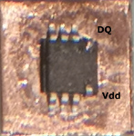
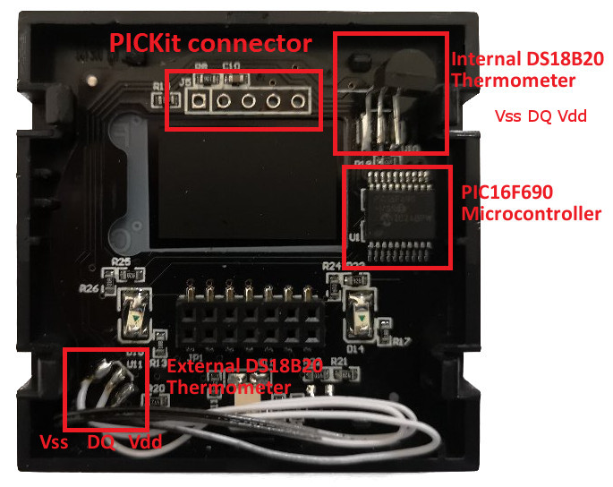

# Hardware modifications
You will need some soldering experience and probably a magnifying glass to do these mods.  
Obviously this will void the warranty and I do not assume any responsibility.  
## External thermometer
As there is not much airflow the measurement if the thermometer behind the airflow holes is not really accurate. In addition it gets tampered by the heat produced from the thermostat itself. So I started thinking how to build a better sensor.
As the temperature is measured on the Vss pin I came up with the idea to use a small copper plate and the SMD version of the chip. All pins are soldered directly to the plate with the exception of pin 1 (DQ) and pin 8.  
In order to make it even easier my firmware supports the so called parasite power mode where the thermometer does not need to be self-powered and takes the power from the DQ pin. So can solder pin 8 Vdd also directly to the plate.
Then I put the copper plate on top of a square alu profile so that the chip is inside and put it on top of the thermostat just with super glue. Finally I painted it black.
Now we just connect the external sensor instead of the internal.  
  
SMD DS18B20 soldered to copper plate with pin 1 and 8 bend up for connecting the wires  
  
Top view on the sensor  
  
Bottom view  
  
Wiring  

Front view with painted thermometer  

## Light sensor
The PIC16F690 has a built-in A/D converter, so we can simply use a LDR for it. I used the GM5516 but any other will do as well. As there is no free pin left best solution is just removing the internal thermometer next to the power train. It has no real use.  
But unfortunately this pin RB6 is one of the few which cannot be used with the A/D converted but RB4 can be used. So we just solder the thermometer to RB6 and the light sensor to RB4.
The firmware automatically detects this. First it probes the thermometer on RB4 and if it is not present then it tries RB6 and assumes that a light sensor is present on RB4.  
  
The light sensor is placed top left.  
  
Thermostat with both mods

I just used super glue again for fixing it and painted it black around in order to avoid picking up light from the display itself.          
