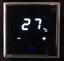
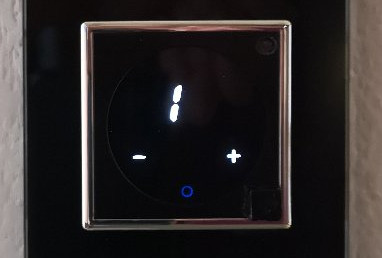
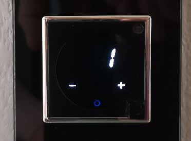
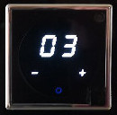
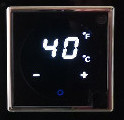

# User manual
## Temperature
The temperature can be adjusted by touching "+" or "-".  
The first touch just displays the current target temperature and subsequent touches change it.  
  
The temperature unit flashes to indicate that the target temperature is displayed  
After 4 seconds the display will display again the current temperature  

The blue circle indicates that the heating/cooling is currently off.  
When the heating/cooling is active the indicator will turn red.  
## Stand by
Touching the 'O' will turn the the thermostat to stand-by, which will turn off the display.  
In heating mode the minimum temperature is set to 5° Celsius / 41° Fahrenheit (freeze protection)
## Display off (night mode)
Long touching 'O' (more than 1 second) will just turn the display off but leave the temperature as it is

## Automatic night mode
If you added the light sensor, night mode will turn on automatically when the light level falls below the threshold.
If you touch a sensor the display will turn again and stay on for 10 seconds

## Setup mode
Long touch '+' and '-' (more than 1 second) at the same time or one after each other.  
Each setting can be adjusted with '+' and '-' and 'O' advances to the next setting in this sequence:  

### Temperature offset / calibration (Left or right digit is flashing, C and F off)
If the temperature at the thermostat is higher or lower than your reference point you can add a positive or negative offset  
The range is from -9 to 9 and corresponds to steps of 0.5° Celsius or 1° Fahrenheit  
Negative values are displayed on the left  
  
and positive values on the right  
  

### Delay after temperature change (Both digits flashing, C and F off)
Time to wait after a temperature change to settle before acting the heating  
The range is from 01 to 99 with a unit of 10s.  
So the minimum delay is 10s and the maximum 16:30 (99 * 10s)  
  
Setting a new temperature however always has an immediate effect  

### Unit Celsius / Fahrenheit (Digits off, C or  F flashing)
Switches between Celsius and Fahrenheit

### Valve maintenance days (Both digits and C flashing, F off)  
This is a setting for water heating / cooling.  
Automatic valve maintenance opens the valve periodically for 5 minutes, in order to avoid that they get stuck if not in use for a long time (e.g. summer)  
The range is from 0 to 14 days, whereas 0 means off.

### Operation mode (Right digit and F flashing, C off)
0 - Heating, Line active when current temperature is below the target temperature  
1 - Cooling, Line active when current temperature is above the target temperature  

### Light sensor value (Both digits and C and F flashing)
The current reading of the light sensor. If no sensor is present then it defaults to 50  

### Light sensor threshold (Both digits flashing, C and F off)
Threshold for turning the display off (night mode). The light sensor value from the step before can be used to find a good setting.  

[Back to README](/README.md)  
[Hardware description](/doc/hardware.md)  
[Hardware modifications](/doc/hardware_mod.md)  
[Firmware update](/doc/programmer.md)  
