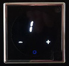

# User manual
## Temperature
The temperature can be adjusted by touching "+" or "-".  
  
After 2 seconds the display will display again the current temperature  
The blue circle indicates that the heating is currently off.  
When the heating is active the indicator will turn red.  
## Stand by
Touching the 'O' will turn the the thermostat to stand-by, which will turn off the display and set the minimum temperature to 5° Celsius / 41° Fahrenheit (freeze protection)
## Display off (night mode)
Long touching 'O' (more than 1 second) will just turn the display off but leave the temperature as it is

## Automatic night mode
If you added the light sensor night mode will turn on automatically when the light level falls below the threshold.
If you touch a sensor the display will turn again and stay on for 10 seconds

## Setup mode
Long touch '+' and '-' (more than 1 second) at the same time or one after each other.  
Each setting can be adjusted with '+' and '-' and 'O' advances to the next setting in this order:  
### Temperature offset (calibration)
If the temperature at the thermostat is higher or lower than your reference point you can add a positive or negative offset  
The range is from -9 to 9 and corresponds to steps of 0.5° Celcius or 1° Fahrenheit  
Negative values are displayed on the left  
  
and positive values on the right  
  

### Delay after temperature change
Time to wait after a temperature change to settle before acting the heating  
The range is from 01 to 99 with a unit of 10s. So the minimum delay is 10s and the maximum 16:30 (99 * 10s)  
  
Setting a new temperature has an immediate effect  

### Unit (Celsius / Fahrenheit)
Switches between Celsius and Fahrenheit

### Light sensor value
This is only displayed if you added the light sensor. The Celsius and Fahrenheit LEDs are flashing as well.

### Light sensor threshold
Threshold for turning the display off (night mode). The light sensor value from the step before can be used to find a good setting.
